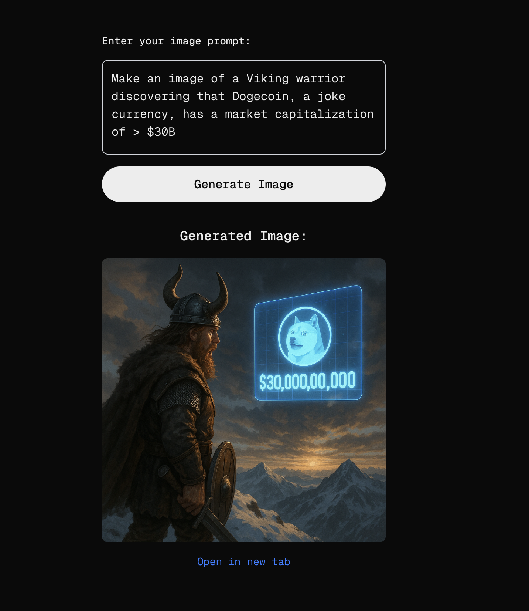

# Test MCP Next.js App



A Next.js application that demonstrates AI-powered image generation using the ATXP (Autonomous Transaction Execution Protocol) client. This app provides a simple web interface where users can enter text prompts to generate images using AI.

## Features

- 🎨 AI-powered image generation from text prompts
- 🖼️ Real-time image display and preview
- ⚡ Built with Next.js 15 and React 19
- 🎯 TypeScript support
- 💅 Styled with Tailwind CSS
- 🔗 Integration with ATXP MCP server

## Getting Started

### Prerequisites

- Node.js 18+ 
- npm or yarn
- Base blockchain account with private key
- Access to Base RPC endpoint

### Environment Setup

Create a `.env.local` file in the root directory with the following variables:

```env
# Base blockchain RPC endpoint
BASE_RPC=https://mainnet.base.org

# Your Base blockchain private key (with 0x prefix)
BASE_PRIVATE_KEY=0x1234567890abcdef...

# Optional: Custom MCP server endpoint (defaults to https://image.mcp.atxp.ai)
# MCP_SERVER_URL=https://your-custom-server.com
```

**Important:** 
- Keep your private key secure and never commit it to version control
- Your Base account needs sufficient funds to pay for blockchain transactions
- The private key must include the `0x` prefix

### Installation

1. Clone the repository
2. Install dependencies:
   ```bash
   npm install
   ```

3. Set up your environment variables in `.env.local`

4. Run the development server:
   ```bash
   npm run dev
   ```

5. Open [http://localhost:3000](http://localhost:3000) in your browser

### Available Scripts

- `npm run dev` - Start development server
- `npm run build` - Build for production
- `npm run start` - Start production server
- `npm run lint` - Run ESLint

## How It Works

1. **Frontend**: Users enter image generation prompts in a textarea
2. **API Route**: The `/api/atxp` endpoint processes requests using the ATXP client
3. **Blockchain Integration**: Uses Base blockchain account to authenticate with MCP server
4. **Image Generation**: Calls the `image_create_image` tool via MCP protocol
5. **Display**: Generated images are displayed with download links

## Project Structure

```
src/
├── app/
│   ├── api/atxp/
│   │   └── route.ts          # ATXP API endpoint
│   ├── layout.tsx            # Root layout
│   └── page.tsx              # Main application page
└── styles/
    └── globals.css           # Global styles
```

## Technologies Used

- **Next.js 15** - React framework with App Router
- **React 19** - UI library
- **TypeScript** - Type safety
- **Tailwind CSS** - Utility-first CSS framework
- **@atxp/client** - ATXP protocol client
- **Base Blockchain** - Layer 2 Ethereum network

## Contributing

1. Fork the repository
2. Create a feature branch
3. Make your changes
4. Run linting: `npm run lint`
5. Submit a pull request

## License

This project is private and for testing purposes.
